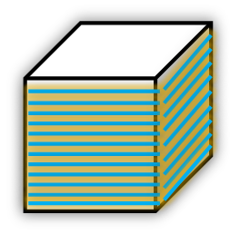
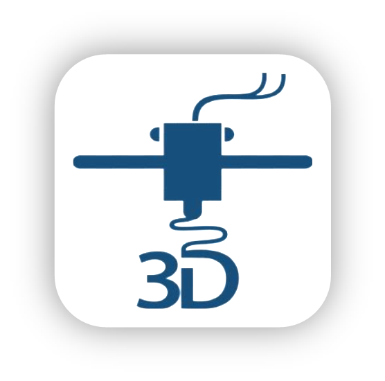

# ERPLibre Addons 3D printing

Compatible with Odoo 12

This project is work in progress, not ready for production.

---

### The addons for managing a 3D printer farm within ERPLibre

---

Those addons help link ERPLibre with Mainsail/Klipper and SuperSlicer.

- **_ERPLibre_** : e-commerce, products, stocks, management
- **_Mainsail/Klipper_** : management of the printers
- **_SuperSlicer_** : slicing of the 3D models

## Usage (Local use only, not destined to the internet)

---

After installation of the modules, 4 ports forwarding (ssh forwarding) are required on the machine used for the connections :
- **8069** : allow connection to ERPLibre
- **7136** : allow connection to the G-Code Viewer (PGcode Viewer)
- **7125** : allow connection to the websocket of the printer linked with that G-Code Viewer instance
- **5000** : allow connection to the SuperSlicer Server

**N.B.** : Those forwarding can be on the same Domain (IP). (Example : 127.0.0.1)
