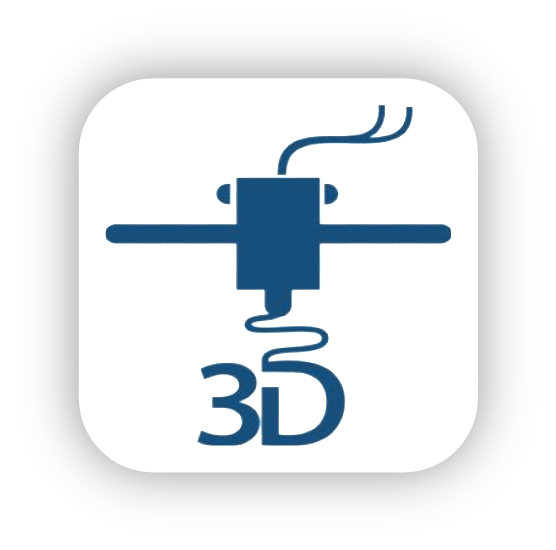

# Website Print 3D (website_print_3d)

---

### The module for ordering 3D printing in the e-commerce website.

This module contains 2 models :
- Profile3DProduct : inherit **_product.template_** (it links a product to a profile)
- Profile3DSale : inherit **_sale.order_** (it adds 2 new field to an order)
  - _model_file_ : to attach the 3D model to print
  - _print_time_ : to keep the estimated printing time for this order

## Dependencies
- **Internal**
  - _web_slicing_profile_
  - _web_slicing_server_
  - _mail_
  - _website_sale_
- **External**
  - Python
    - _requests_
    - _orjson_
